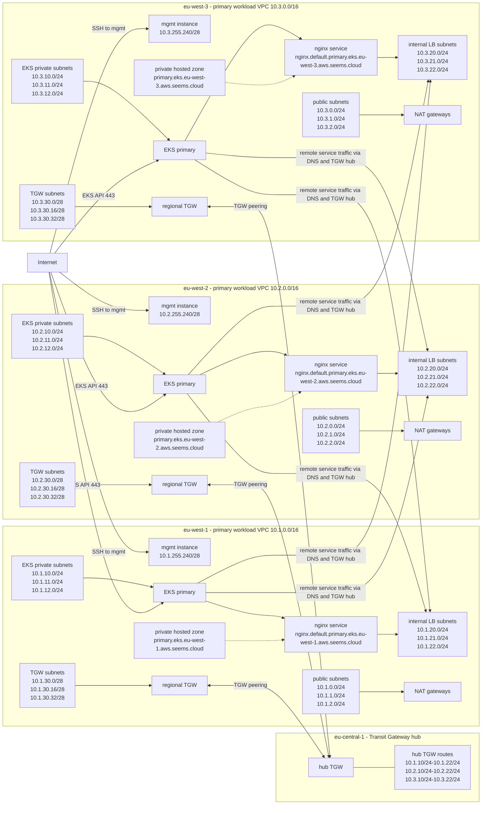

# terraform-aws-demo

Terragrunt/OpenTofu project for a multi-region AWS dev environment. The deployable stack lives under `environments/theanotherwise`; reusable single-purpose Terraform modules live under `modules`.

## Architecture

The environment is built as three workload regions connected through a Transit Gateway hub in `eu-central-1`. Each workload region has one `primary` VPC, one `primary` EKS cluster, one `mgmt` instance, regional private DNS, and dedicated subnets for public, private/EKS, internal load balancers, and Transit Gateway attachments.

## Regional layout

| Region | VPC CIDR | Public subnets | EKS private subnets | Internal LB subnets | TGW subnets | Mgmt subnet |
| --- | --- | --- | --- | --- | --- | --- |
| `eu-west-1` | `10.1.0.0/16` | `10.1.0.0/24`, `10.1.1.0/24`, `10.1.2.0/24` | `10.1.10.0/24`, `10.1.11.0/24`, `10.1.12.0/24` | `10.1.20.0/24`, `10.1.21.0/24`, `10.1.22.0/24` | `10.1.30.0/28`, `10.1.30.16/28`, `10.1.30.32/28` | `10.1.255.240/28` |
| `eu-west-2` | `10.2.0.0/16` | `10.2.0.0/24`, `10.2.1.0/24`, `10.2.2.0/24` | `10.2.10.0/24`, `10.2.11.0/24`, `10.2.12.0/24` | `10.2.20.0/24`, `10.2.21.0/24`, `10.2.22.0/24` | `10.2.30.0/28`, `10.2.30.16/28`, `10.2.30.32/28` | `10.2.255.240/28` |
| `eu-west-3` | `10.3.0.0/16` | `10.3.0.0/24`, `10.3.1.0/24`, `10.3.2.0/24` | `10.3.10.0/24`, `10.3.11.0/24`, `10.3.12.0/24` | `10.3.20.0/24`, `10.3.21.0/24`, `10.3.22.0/24` | `10.3.30.0/28`, `10.3.30.16/28`, `10.3.30.32/28` | `10.3.255.240/28` |

## Traffic model

- Internet can reach the public EKS API endpoint in each workload region.
- Internet can reach each regional `mgmt` instance over SSH.
- Each regional `mgmt` instance can reach local EKS nodes in the same region.
- EKS workloads reach services in other regions through private DNS, internal NLB addresses, regional TGWs, and the `eu-central-1` TGW hub.
- Private hosted zones are regional by name, but each zone is associated with all workload VPCs, so every cluster can resolve every regional service name.
- The VPC CNI add-on excludes remote load balancer CIDRs from SNAT, and the test NLB service preserves client IPs so remote services can see pod source IPs.

## Main service names

| Region | Service DNS name |
| --- | --- |
| `eu-west-1` | `nginx.default.primary.eks.eu-west-1.aws.seems.cloud` |
| `eu-west-2` | `nginx.default.primary.eks.eu-west-2.aws.seems.cloud` |
| `eu-west-3` | `nginx.default.primary.eks.eu-west-3.aws.seems.cloud` |
